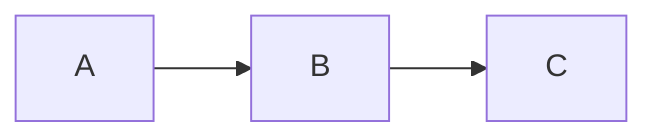

# injective 
* one to one
* given that F(x) = F(y) there is x=y 

# surjective 
* onto
* given that the co-domain equal to the range 

# bijective 
* both inejctive and surjective

# compositio of funcions 
* if the co-domain of a function (**not range !!!!!**) is equal to the domain of another fucntion
* e.g we have F,G function follows the condition above, we can use the OUPUT of F as the input of G


# Numbers
* Natural Numbers
    * Natural nunber $\N$ does not include zero
    * Natrual number and zero can be expressed in $\N*$
* Interger numbers
    * considering that the I is genally occupied for other stuff (imaagery number number and other stuffs), the interger is generally denoted by $\Z$
    * $\Z$ = {.... , -2,-1,0,1,2, .....}
* Real Number
    * Rational number: the real numebr how can be expressed as a fraction of integer numbers (a = b/c) where c != 0 
        * {$Q$} is the symbol of the rational number
    * Irrational number: the opposite of the rational 




```python
print("dhasjkhjksaf")
```